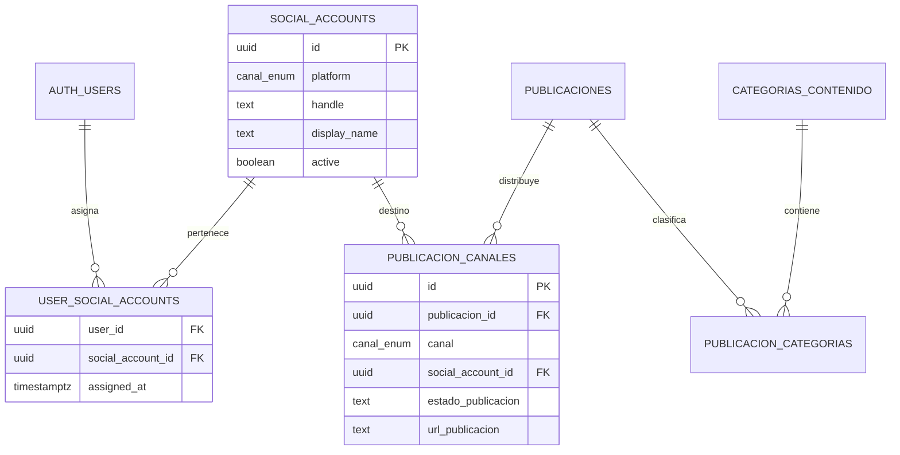

# Publicaciones por cuenta social

## Modelo de datos

`publicacion_canales.canal` conserva la plataforma; `social_account_id` identifica la cuenta concreta. La clave única es `(publicacion_id, social_account_id)`, que permite asignar una publicación a más de una cuenta Instagram. Las publicaciones existentes sin asignación se conservan con `social_account_id = NULL` y no aparecen en las vistas con alcance por cuenta hasta clasificarlas.

## Aplicación y RLS

- Grid y Kanban leen `publicaciones` con el cliente ligado a la sesión. RLS limita las filas a publicaciones con al menos un destino asignado al usuario.
- Las publicaciones compartidas se pueden leer desde cualquiera de sus cuentas asignadas. Para editar campos globales o eliminar una publicación, el usuario debe tener asignadas todas sus cuentas destino; así un cambio no afecta silenciosamente a una cuenta de otro responsable.
- Grid ofrece un filtro por cuenta dentro del conjunto que RLS ya autorizó.
- Los modales de creación y edición muestran las cuentas asignadas al usuario; crear requiere al menos una cuenta destino.
- Las acciones de publicaciones usan el cliente autenticado. Las funciones `create_publicacion_with_relations` y `update_publicacion_with_relations` guardan publicación, destinos y categorías en una sola transacción y como funciones `SECURITY INVOKER`.
- Un trigger diferible exige que las publicaciones nuevas terminen la transacción con al menos un destino. No invalida las publicaciones históricas que todavía no tienen cuenta.
- `replace_publicacion_categorias` ahora se ejecuta bajo los permisos y políticas RLS del usuario.

## Aplicación manual en Supabase

La estructura base de cuentas y políticas iniciales se aplicó desde SQL Editor. El siguiente paso de base de datos está en [`202610080001_authenticated_publication_writes.sql`](../supabase/migrations/202610080001_authenticated_publication_writes.sql). Pegar su contenido completo en SQL Editor antes de usar las nuevas acciones: define las funciones transaccionales y los permisos RLS de escritura que requieren.

Las asignaciones iniciales son administradas en `user_social_accounts`. La asignación de una cuenta a un usuario concede acceso a las publicaciones relacionadas; los permisos funcionales por rol siguen siendo necesarios. Administradores no reciben acceso global automático si no están asignados a las cuentas.
